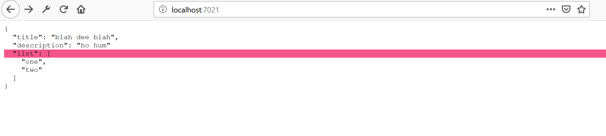

# A JSON editor

This is an ES6 module for editing a JSON file.



It performs validation based on JSON syntax but also can be extended
with further checking.


## Build

This uses my recently created [loss-less JSON parser](https://github.com/nicferrier/nics-json-parser) 
via NPM.

The parser modules are left in node_modules, which is frustrating.

Eventually I'll make express middleware to make that easier, but for
now I simply copy the relevant files to where I want them with a
prepare script.

To repeat this step, do this:

```
$ npm run-script prepare
```

The relevant scripts are gitignored so they won't cause any problems.

